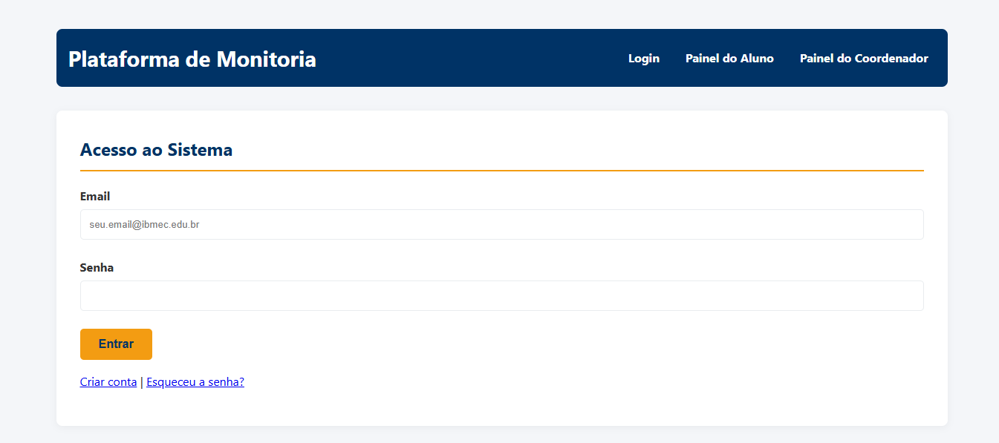

## Introdução

A construção de um protótipo conceitual auxilia a equipe a definir um nível de detalhes abrangente sobre o fluxo de navegação, extrair funcionalidades essenciais e planejar a usabilidade inicial. Ele também fornece uma base para o gerenciamento do projeto, pois com o protótipo é possível realizar estimativas mais precisas sobre o desenvolvimento de cada funcionalidade.

## Metodologia

Após as fases de pesquisa e ideação, a equipe utilizou o **Google Gemini** para gerar as descrições e a estrutura de todas as telas principais do aplicativo. O foco foi detalhar os componentes e o fluxo do usuário de forma textual, antes da implementação visual ou da codificação.

## Estrutura do Protótipo

### Versão 1.0

### Tela Login

Estrutura básica com campos para e-mail, senha и botão de login.

### Tela Cadastro 1

Formulário para informações pessoais do aluno (nome, e-mail, senha, curso).

### Tela Cadastro 2

Campos adicionais do perfil, como período e matrícula.

### Tela Esqueceu Senha

Interface para recuperação de senha via e-mail.

### Tela de Vagas (Feed)

Listagem das vagas de monitoria disponíveis, com cards resumidos (matéria, professor, prazo).

### Tela de Vagas com Filtros

Opções para filtrar as vagas por curso ou buscar por palavra-chave.

### Tela Perfil do Aluno

Área onde o aluno pode ver e editar suas informações pessoais.

### Tela Cadastrar Vaga de Monitoria 1 (Coordenador)

Primeira parte do formulário para o coordenador preencher os detalhes da vaga (matéria, professor).

### Tela Cadastrar Vaga de Monitoria 2 (Coordenador)

Segunda parte do formulário com pré-requisitos e descrição das atividades.

### Tela Cadastrar Vaga de Monitoria 3 (Coordenador)

Definição do número de vagas e prazo final para as inscrições.

### Tela de Detalhes da Vaga

Visão completa de uma vaga específica, com botão para o aluno se candidatar.

### Minhas Candidaturas (Aluno)

Tela para o aluno acompanhar o status das vagas para as quais se candidatou.

### Vagas Criadas (Coordenador)

Painel para o coordenador visualizar e gerenciar as vagas que publicou.

Na primeira versão do protótipo, o foco foi validar o fluxo principal de candidatura do aluno e o de criação de vaga pelo coordenador.

### Versão 2.0

### Tela Login

(Sem alterações significativas)

### Tela Cadastro

(Unificado em uma única tela para simplificar o fluxo)

### Tela Esqueceu Senha

(Sem alterações significativas)

### Tela Perfil do Usuário

(Adicionado campo para link do currículo Lattes)

### Tela de Vagas (Feed)

(Melhorias na apresentação das informações nos cards)

### Tela de Gerenciamento de Candidatos (Coordenador)

Nova tela que lista todos os alunos inscritos em uma determinada vaga.

### Tela de Avaliação de Candidato (Coordenador)

Interface para o coordenador visualizar os detalhes de um único candidato, baixar seus documentos e alterar seu status no processo seletivo.

### Painel do Coordenador

Tela inicial do coordenador, com um resumo das vagas ativas e número de novos candidatos.

## Conclusão

A partir da elaboração do protótipo conceitual, foi possível ter uma noção clara da arquitetura de informação e da interface do usuário, definindo o fluxo de navegação, a disposição dos botões e os componentes necessários para cada tela antes de avançar para a fase de desenvolvimento.

## Referências

> PMI. Um guia do conhecimento em gerenciamento de projetos. Guia PMBOK® 5a. ed. EUA: Project Management Institute, 2013.

## Autor(es)

| Data | Versão | Descrição | Autor(es) |
| -- | -- | -- | -- |
| 28/09/2025 | 1.0 | Criação do documento com o fluxo inicial | Bruno Norton e Gabriel Pereira |
| 30/09/2025 | 2.0 | Adicionada a versão 2.0 com telas do coordenador e ajustes de fluxo | Bruno Norton, Gabriel Pereira, Iago Viana e Pedro dos Santos |